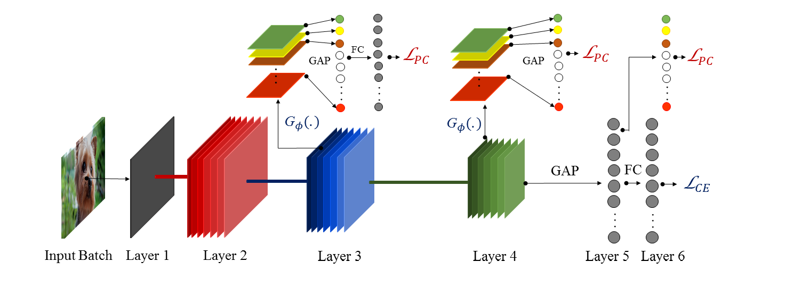

# Adversarial Defense by Restricting the Hidden Space of Deep Neural Networks


This repository is an PyTorch implementation of the paper [Adversarial Defense by Restricting the Hidden Space of Deep Neural Networks](https://arxiv.org/abs/1904.00887)

To counter adversarial attacks, we propose Prototype Conformity Loss to class-wise disentangle intermediate features of a deep network. From the figure, it can be observed that the main reason for the existence of such adversarial samples is the close proximity of learnt features in the latent feature space.

We provide scripts for reproducing the results from our paper.


## Clone the repository
Clone this repository into any place you want.
```bash
git clone https://github.com/aamir-mustafa/pcl-adversarial-defense
cd pcl-adversarial-defense
```
## Softmax (Cross-Entropy) Training
To expedite the process of forming clusters for our proposed loss, we initially train the model using cross-entropy loss.
 
``softmax_training.py`` -- (for initial softmax training).

* The trained checkpoints will be saved in ``Models_Softmax`` folder.


## Prototype Conformity Loss
The deep features for the prototype conformity loss are extracted from different intermediate layers using auxiliary branches, which map the features to a lower dimensional output as shown in the following figure.



``pcl_training.py`` -- (for our training).

* The trained checkpoints will be saved in ``Models_PCL`` folder.


## Accuracy Prediction

``Accuracy.py`` (Evaluate the performace of our method by comparing accuracies on adversarial and recovered images).

## Citation
```
```
